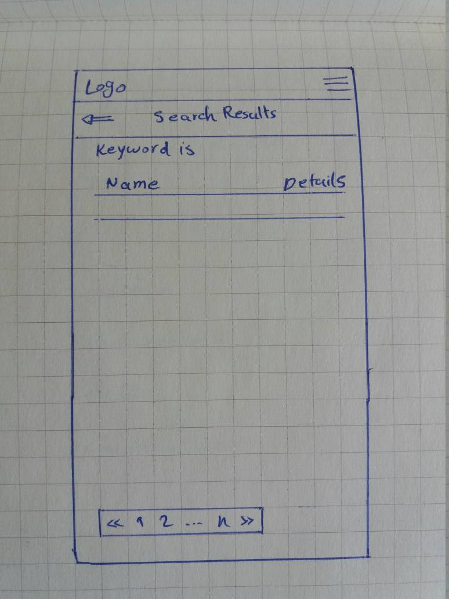
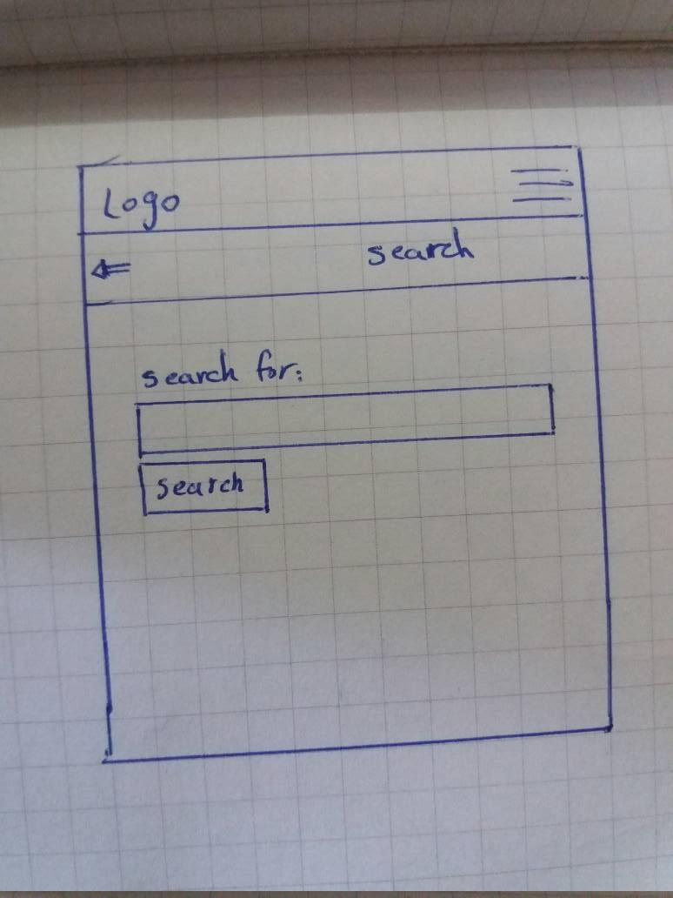

# Roadmap and Scheduling
## Introduction
This document is the roadmap and schedule for the project. For more information about the project, definition refer to
## Schedule.
This document is updated periodically. The following table shows the steps needed to implement the project:

| Task                                                          | Expected Time |
|---------------------------------------------------------------|---------------|
| Study Ruby     |  2 days |
| Study Ruby on Rails      |  7 days |
| Prototyping  |   5 days |
| Define the repository, schedule and roadmap				    |1 day          |
|Design models								                    |1 day          |
|Design Views								                    |1 day          |
|Design Controllers							                    |1 day          |
|Create project, models							                |1 day          |
|Implement controllers 				        |2 days          |
|Implementation of user authentication and CRUDs of favorite lists	|2 days     |
|Implementation of views							                |2 days     |
|Applying appropriate style sheet					                |2 days     |
|**Total**								                            |**27 days**|
## Timesheet
Here is the project timeline shown. The following table shows the activities, dates, and duration.

 Date | Description | Time 
------|-------------|------
2018 - March   | Study Ruby | 2 days
April-May 2018 | Study Rails| 7 days
2018-May-13   	| Define the repository, schedule and road map	|	1 day
2018-May-14    | Prototyping(1) rest calling, routing, controllers | 2 Days
2018-May-15    |Desing first version of data model     | 0.5 day
2018-May-16 | 1- Adding coresponding views 2- Adding project, thesis, and person search methods			| 0.5 Day
2018-May-17 | Design of controllers and modes				| 1 Day
2018-May-18 | Implementation of Application layouts			| 2 Days
2018-May-20 | Implementing Models 					| 0.5 Day
2018-May-20 | Constructing controllers					| 0.5 Day
2018-Jun-05 | Working on Bootstrap for styling				| 2 Days
2018-Jun-07 | Homepage implementation and Logo Desing			| 1 Day
2018-Jun-08 | Implementation of Helper classes EntityExtractor and TURestFactory	 		| 1 Day
2018-Jun-09 | Implementation of action bodies in controllers consisting of *list*, *search*, and *detail* in 4 main controllers and *add* and *remove* in **favourtie** controllers		| 1 Day
2018-Jun-10 | Implementation of 4 detail views as well as completing all other views		| 1 Day
2018-Jun-11 | Completing user management(signup- login - logout)	| 1 Day 
2018-Jun-12 | Adding pagination						| 0.5 Day
2018-Jun-12 | Bug fixing, deplyment on Herku site			| 0.5 Day
2018-Jun-22 | Negotiation with product owner, Add model validation of the length of the search expression, Add corresponding error shower to the search view | 1 Day
2018-Jun-23 | Add AbstractController (parent of 4 main controllers) and make the hierarchical structure, Adding DataTable support(bootstrap & jquery) and add sorting to the lists | 1 Day
2018-Jun-24 | Adding add/remove to/from favourites possibility to the lists, Adding ajax support to the add/remove to/from favourites operations in list | 1 Day
2018-Jun-25 | Bug fixing | 1 Day
2018-Jun-26 | Deliver project through final meeting | 1 Day

### Study Ruby and Ruby on Rails
For starting with ruby a fast toturial [*Ruby Tutorial*](https://www.tutorialspoint.com/ruby/index.htm) is choose .
A nice online toturial is read for the course and project which is called [*Ruby on Rails Tutorial Learn Web Development with Rails*](https://www.railstutorial.org/book) by **Michael Hartl**. In addition to the basic RoR requirements, it covers many advanced topic of front-end development.

### Prototyping
In order to have better idea about designing the project and due to the fact that the author does not have much experience in *RoR*, a prototyping is being done.

### Online Deployment
In order to test the tool with mobile devices, a constant deployment has been done on the [*heroku* cloud platform](https://tissror.herokuapp.com/)

### Data Model
The data model is available in [dataModel.MD](https://github.com/hanifmaleki/TissRoR/blob/master/DesignAndScheduling/schedule.MD)

### List of Views
The following is the list of views. 

#### Static-Page
Static-Page controller contains following views/actions:
1. home
2. about
3. contact

The most important view is home view. Here its design is shown

#### Project
1. search
2. list
3. detai

#### Thesis
1. search
2. list
3. detai

#### Course
1. search
2. list
3. detai

#### Person
1. search
2. list
3. detai

#### Favourites
1. Favourite theses
2. Favourite courses
3. Favourite people
4. Favourite projects

#### User
1. sign-up
2. (edit user)

#### Session
1. login
2. logout (only action)

### Layouts
The application basically use two king of layouts. The **welcome**-layout for login and sign-up pages and **'application'**-layout for other pages. The welcome layer consist of the logo. The following layouts are necessary for the application-layout
1. header: consist of the top navigation bar 
2. second-nav-bar: consists of second navigation bar (for searchs and details page).
3. footer: consist of paging that is used in favorite and list pages.
4. detail-nav-bar: the navigation bar sepecific for detail pages consisting of add to/remove from favourite button.

### List of Controllers, Actions and Controller Helpers
There exist exactly one action for each view in the above list. Furthermore two helper class for calling **Restful web services** and extracting models(person, course, project, thesis) from XML file. Theses classes are called **TRRestFactory** and **EntityExtractor**.

Since all of the four main controllers(ProjectController, CourseControllr, ThesisController, and PersonController) has three activity _search_, _list_, and _detail_ in comon, such main functionalities is done in a common class **AbstractEntityController class** and the remaining specific parts are done in each controller.

### Asynchronous server communication (Ajax technology)
In the final stages of the project, the Ajax technoly is used in order to support asynchronous server call and partial view parts modification. In particular, it is used in the lists in order to prevent loading the whole page when user add/remove an item to/from the favourites.

### Future work
The following are possible extensions to current version:
1. Activating Setting menu and user edit menu
2. Enable user email activation and reset password capability
3. Client-side caching
4. Server-side caching
